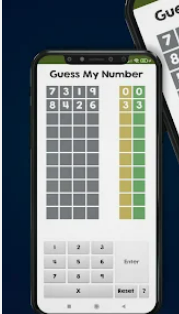
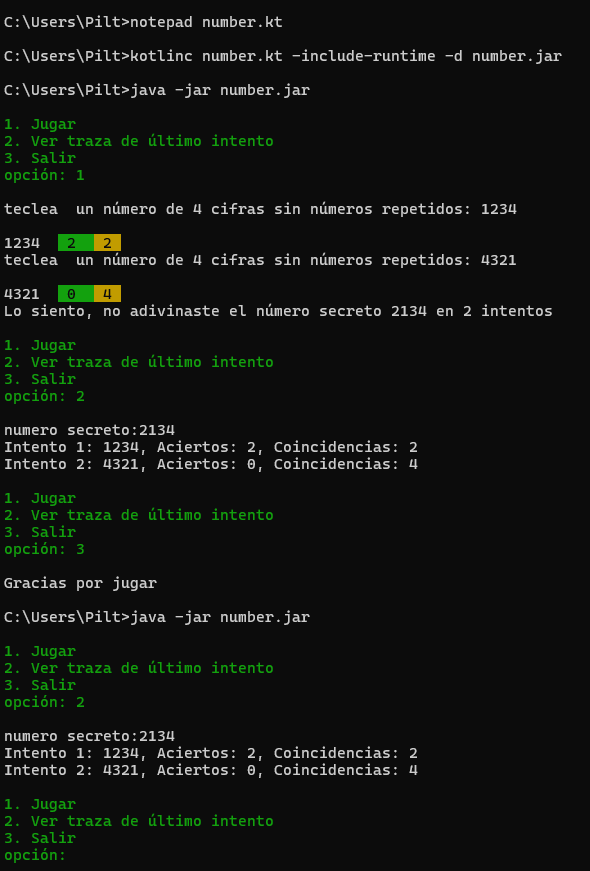

# adivinanumeroenunciado
Se quiere hacer una versión consola de *Guess a number*. 

La aplicación genera internamente un número aleatoio y el usuario debe adivinarlo  en una serie de intentos. Las pistas que dará nuestra aplicación  al usuario es que tras introducir un número por teclado le indicará respecto al número secreto cuantas cifras  son aciertos y cuantos coincidencias. Coincidencia quiere decir que la cifra existe en el número secreto pero no en la misma posición y acierto que existe pero además en la misma posición. Segun al aplicación se puede considerar además que los aciertos también son coincidencias.

Para inspirarte lo mejor es que te inspires, para luego adaptar a consola, en alguna app android como 

o bien alguna versión web como

[Numberle](https://kveez.com/en/numberle/#google_vignette)

SE PIDE:
- es una aplicación de consola y la ejecutamos desde la consola  real del sistema
- puedes usar colores para mejorar presentación
- es de tu libre elección el número máximo de intentos, la longitud del número a adivinar y que digitos pueden forma dicho número. Pero no lo compliques mucho, por ejemplo, puede estar bien que la longitud del número sea de 4 cifras, no puede haber cifras repetidas, solo usamos digitos del 1 al 6 y el número máximo de intentos es 10.
- la última jugada se guarda de forma persistente en un fichero, de forma que incluso en la siguiente ejecución está accesible

Aquí tienes un ejemplo de ejecución. Puedes mejorar mucho esta presentación, pretende simplemente mostrar de forma sencilla la idea del juego.

